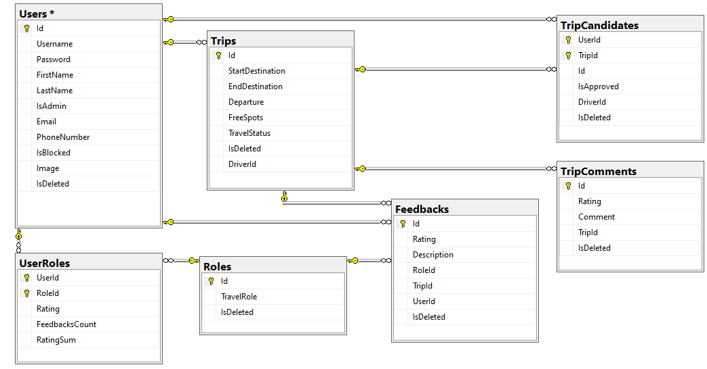

# Carpooling Project Assignment  

## **Project Description**
Carpooling is a web application that enables you to share your travel from one location to other with other passengers. Every user can either organize a shared travel or request to join someone else’s travel. 

## **Technologies Used**
- .NET Core
- ASP.NET MVC
- ASP.NET API
- Swagger
- MS SQL Server
- Entity Framework Core
- HTML5
- CSS3
- Bootstrap
- Moq
- LINQ

Teamwork and communication: GitLab with separate branches, Git Lab Issues and board, MS Teams.

Best programming practices and principles used: OOP, SOLID, and KISS principles, client-side  and server-side data validation, exception handling, unit testing of the "business" functionality, etc.

## **General Information**

Our carpooling solution includes 5 projects:

- Carpooling.Data 
- Carpooling.Services 
- Carpooling.API
- Carpooling.MVC
- Carpooling.Tests

## **Authors**
- [Stanimir Zhekov](https://www.linkedin.com/in/stanimir-zhekov/)
- Stanislav Staykov

## External Services

Carpooling uses the following external service:

- **DeepAI (API)**  
  https://deepai.org/

## **Public Part**

The public part is accessible without authentication i.e., for anonymous users. Anonymous users can see information about Carpooling and its features as well as how many people are using the platform and how many travels have happened.

Our home page looks like this:

And that is our about page:

Anonymous users can register: 

They can also login in their existing profile:

## **Private Part**

Accessible only if the user is authenticated. Users can login/logout, update their profile and set a profile photo.

Each user can create a new travel that he is planning:

Each user can browse the available trips created by other users:

The user can also sort and filter them:

Each user can apply for a trip as a passenger: 

The driver can approve/decline passengers from the candidates’ pool:

The driver can cancel a trip before the departure time:

The driver can also mark the trip as complete:

Passengers can leave feedback about the driver as well as the driver can leave feedback for every passenger. Feedback includes numeric rating (from 0 to 5) and optional text comment:

Each user can view all his travels and all feedback:

The user can also filter and sort them:

## **Administrative Part**

Accessible to users with administrative privileges. Admin users can see list of all users and block or unblock them. A blocked user cannot create travels and apply for travels.

The admin can search users by phone number, username or email:

## **EXTRA Features**

✅ Users cannot upload inappropriate profile photos, because we have Nudity Detection!

✅ Users cannot use swear words when they are leaving comments!

✅ Every new user receives a welcome email.

✅ Customers can contact us with questions or leave us feedback.

## **Database Diagram**

## **API and Swagger Documentation**
The API supports all the functionalities of the web part of the application.

